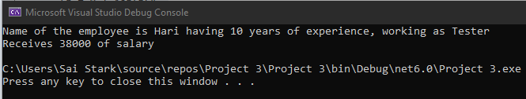

# Ex04-Constructor
## Aim:
 To write a C# program to calculate the salary of an employee by passing the name, designation, noofexperience, basic salary and insurance amount through constructor.
 
 ## Algorithm:
Step1:
Start

Step2:
Create a class and a constructor

Step3:
Get name, designation, noofexperience, basic salary and insurance amount from the User.

Step4:
call salary method in constructor to calculate salary.

Step5:
call display method to display the output.

Step6:
stop

 ## Program:
 ```
 using System;
using System.Diagnostics.Metrics;
using System.Xml.Linq;

namespace palindrome
{
    class emp
    {
        public int experience,salary,insurance;
        public string name, designation;
        public emp(string name, string designation, int experience, int salary,int insurance)
        {
            this.experience = experience;
            this.salary = salary;
            this.name = name;
            this.designation = designation;
            this.insurance=insurance;
        }
        public double hra, ta,Gross=0;
        public void salarycalc()
        {
            hra = 0.2 * salary;
            ta = 0.1 *salary;
            Gross=hra+ta+salary-insurance;
            
        }
        public void showInfo()
        {
            Console.WriteLine("Name of the employee is " + name + " having " + experience+ " years of experience, working as " + designation );
            Console.WriteLine("Receives "+ Gross + " of salary");
        }
    }
    class empdetails
    {
        public static void Main(string[] args)
        {
            emp emp1 = new emp("Hari", "Tester", 10, 30000, 1000);
            emp1.salarycalc();
            emp1.showInfo();


        }
    }
}
 ```
 ## Output:
 
 ## Result:
Thus C# program to calculate the salary of an employee by passing the name, designation, noofexperience, basic salary and insurance amount through constructor is executed successfully.
